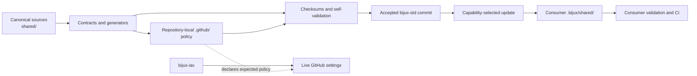

# bijux-std

`bijux-std` is the canonical source for repository engineering standards shared
across Bijux projects. It publishes versioned documentation infrastructure,
Make libraries, GitHub governance, and validation tooling so repositories can
adopt the same contracts without maintaining independent copies.

This repository is infrastructure for repositories, not a product runtime. Its
purpose is to make a shared engineering decision once, verify it here, and let
each consumer adopt an immutable, reviewable snapshot.

## Why This Repository Exists

Repeated repository infrastructure drifts when every project owns a private
copy. Commands acquire different meanings, CI policies diverge, documentation
shells behave differently, and a fix in one repository never reaches the
others. That drift raises review cost and makes local success a poor predictor
of CI behavior.

`bijux-std` replaces copy-and-forget reuse with an explicit contract:

- shared behavior has one canonical implementation;
- every managed directory has a content digest;
- consumers select capabilities rather than individual files;
- downstream updates resolve to an exact accepted Git commit;
- generated content is validated rather than edited by hand;
- product-specific behavior remains owned by the product repository.

The result is consistency without centralizing domain code. A repository keeps
control of its architecture, release decisions, tests, and product
documentation while reusing stable engineering foundations.

## Ownership Boundaries

| Surface | Owner | Responsibility |
| --- | --- | --- |
| Shared repository standards | `bijux-std` | Canonical files, capability contracts, checksums, generators, and validation |
| Product behavior | Consumer repository | Domain code, repository-specific automation, release policy, tests, and content |
| Live GitHub administration | `bijux-iac` | Applied organization and repository settings managed through provider APIs |

The distinction between declared and applied governance is intentional.
`bijux-std` owns versioned files such as workflows, ruleset declarations,
templates, and policy checks. `bijux-iac` owns the live GitHub settings that
cannot be established merely by committing those files.

Do not place product code, domain logic, repository-specific release behavior,
or one-off automation here. Conversely, do not repair a shared standard
independently in every consumer. Correct the canonical source, validate it, and
then refresh consumers from the accepted commit.

## System Model



Changes move left to right. Canonical sources must pass their own contracts
before consumers pin and vendor them. Consumer repositories never depend on a
developer's local checkout or on the moving state of `main`.

## Shared Packages

The managed inventory is declared in
[`shared/bijux-checks/bijux-std-checks.yml`](shared/bijux-checks/bijux-std-checks.yml).

| Package | Stable responsibility |
| --- | --- |
| [`shared/bijux-makes`](shared/bijux-makes) | Language-neutral Make entry points, artifact containment, documentation execution, help, and gate composition |
| [`shared/bijux-makes-py`](shared/bijux-makes-py) | Python-specific formatting, linting, testing, packaging, and environment targets |
| [`shared/bijux-makes-rs`](shared/bijux-makes-rs) | Rust and Cargo gates, nextest lanes, slow-test selection, and pinned-source full-suite execution |
| [`shared/bijux-docs`](shared/bijux-docs) | MkDocs shell, visual assets, navigation registry, synchronization, and documentation checks |
| [`shared/bijux-checks`](shared/bijux-checks) | Capability selection, remote synchronization, digest validation, and standards reporting |
| [`shared/bijux-gh`](shared/bijux-gh) | Canonical GitHub workflows, templates, policy scripts, and repository governance sources |

[`shared/shared-dir-sha256.txt`](shared/shared-dir-sha256.txt) records the
canonical digest of every managed shared package. The root [`.github/`](.github)
tree contains this repository's own rendered configuration and policy
workflows. Consumer-specific GitHub files are selected from the manifest-driven
sources rather than copied indiscriminately.

## Capability Contract

Consumers request coherent capabilities. The `common` capability is always
present because synchronization, checks, GitHub governance, and
language-neutral Make behavior form the baseline contract.

| Capability | Managed content |
| --- | --- |
| `common` | `bijux-makes`, `bijux-checks`, and `bijux-gh` |
| `docs` | `bijux-docs` |
| `python` | `bijux-makes-py` |
| `rust` | `bijux-makes-rs` |

For example, a Rust repository with a documentation site adopts:

```bash
BIJUX_STD_REF=<accepted-commit-sha> \
BIJUX_STD_CAPABILITIES="docs rust" \
make bijux-std-update
```

Explicit selection removes managed packages outside the selected capability
set. Omitting `BIJUX_STD_CAPABILITIES` retains the complete inventory for
repositories that consume every package. Unknown capabilities fail closed.

`BIJUX_STD_REF` accepts a SHA, branch, or tag, but downstream repositories
should commit updates produced from an accepted full commit SHA. An exact pin
makes the source auditable, prevents a moving branch from changing the result,
and allows the same bytes to be reproduced in CI.

## Consumer Layout

Managed packages are vendored into `.bijux/shared/` in each consumer:

```text
.bijux/
├── checks.consumer.json
└── shared/
    ├── bijux-checks/
    ├── bijux-gh/
    ├── bijux-makes/
    ├── bijux-makes-rs/
    └── shared-dir-sha256.txt
```

The exact directories depend on selected capabilities. A root-level `shared/`
tree in a consumer is not a second source of truth and is rejected as layout
drift. Checkout, staging, report, cache, and validation output belongs under
the consumer's `artifacts/` directory.

Consumer repositories configure the shared contract through their own Make
files and repository manifests. They may extend shared targets with
domain-specific gates, but they must not silently change the meaning of a
standard target such as `test`, `lint`, or `docs-check`.

## Change and Adoption Flow

**Author in `bijux-std`.** Change the package that owns the behavior. Update its
contract, tests, generated surfaces, and canonical digest together.

**Validate the source.** Run standards checks and contract tests. Generated
configuration must reproduce a clean worktree, and checksum verification must
match the committed content.

**Merge through review.** CI validates standards, contracts, reports, pinned
actions, and repository policy. The accepted commit becomes the immutable
source for downstream adoption.

**Refresh consumers.** Each consumer updates from that exact commit with its
declared capabilities, reviews the vendored diff, recomputes its managed
checksum manifest, and runs its repository gates.

**Promote independently.** Consumers merge their own updates only after local
behavior remains green. A standards merge does not silently mutate downstream
repositories.

This separation keeps a shared change reviewable both as a platform decision
and as an adoption decision in every affected product.

## Commands

Run these commands from the repository root.

| Command | Purpose |
| --- | --- |
| `make bijux-std-checks` | Validate the shared inventory, content digests, consumer contract, and repository policy |
| `make contract-tests` | Exercise synchronization, capability, checksum, Make, and policy contracts |
| `make bijux-std-update` | Refresh managed standards from the configured canonical source |
| `make bijux-std` | Run the standard compliance check entry point |
| `make ui-test` | Run viewport-aware regression checks for the shared documentation shell |
| `make ui-test-navigation` | Exercise shared navigation journeys |
| `make ui-test-release-gate` | Run the complete documentation-shell release gate |

Live documentation navigation can be checked against deployed sites with:

```bash
BIJUX_LIVE_E2E=1 make ui-test-live-navigation
```

The shared Make contracts document additional configuration and extension
points:

- [`shared/bijux-makes/CONTRACT.md`](shared/bijux-makes/CONTRACT.md)
- [`shared/bijux-makes-rs/CONTRACT.md`](shared/bijux-makes-rs/CONTRACT.md)
- [`shared/bijux-checks/README.md`](shared/bijux-checks/README.md)

## Integrity and Generated Content

There are two distinct integrity layers:

- [`shared/shared-dir-sha256.txt`](shared/shared-dir-sha256.txt) attests the
  canonical shared package directories;
- [`.github/bijux-std-shared.sha256`](.github/bijux-std-shared.sha256) attests
  managed GitHub files in this repository.

Consumer capability synchronization owns each consumer's scoped shared
manifest. GitHub configuration synchronization must preserve that manifest so
unselected language libraries do not become accidental requirements.

Repository configuration is rendered from typed manifests, including
[`.github/standards/repo-config.manifest.json`](.github/standards/repo-config.manifest.json)
and
[`.github/standards/workflow-inventory.json`](.github/standards/workflow-inventory.json).
Generated output must be changed through its source manifest or generator.
Hand-editing a synchronized consumer file creates drift and will be rejected by
the checks.

## CI and Review Governance

The primary workflow,
[`.github/workflows/bijux-std.yml`](.github/workflows/bijux-std.yml), runs three
independent lanes without fail-fast behavior:

- `std / standard` verifies managed GitHub checksums, pinned actions, and the
  standards contract;
- `std / contracts` runs the contract test suite;
- `std / report` executes the shared check runner and uploads its report even
  when investigation requires artifact inspection.

Separate policy workflows validate GitHub configuration and pull-request
approval. An owner-authored pull request requires the
`owner-self-signoff` label as an explicit review decision. Required status
contexts and merge behavior are governed by the checked-in ruleset and the live
settings applied by `bijux-iac`.

Changes should be split by durable intent. A shared implementation, its tests,
its generated output, and its checksum update belong together when they are
inseparable for correctness. Unrelated standards must remain independently
reviewable.

## Deciding Where a Change Belongs

A change belongs in `bijux-std` when multiple repositories should consume the
same behavior and divergence would be a defect. It belongs in a consumer when
the behavior expresses that product's domain, release policy, supported
toolchain, data model, or operational needs. It belongs in `bijux-iac` when the
change applies live organization or repository administration through an API.

When the boundary is uncertain, start with the owner of the invariant. Shared
mechanics belong here; product decisions do not.

## License

This repository is licensed under the [MIT License](LICENSE).
